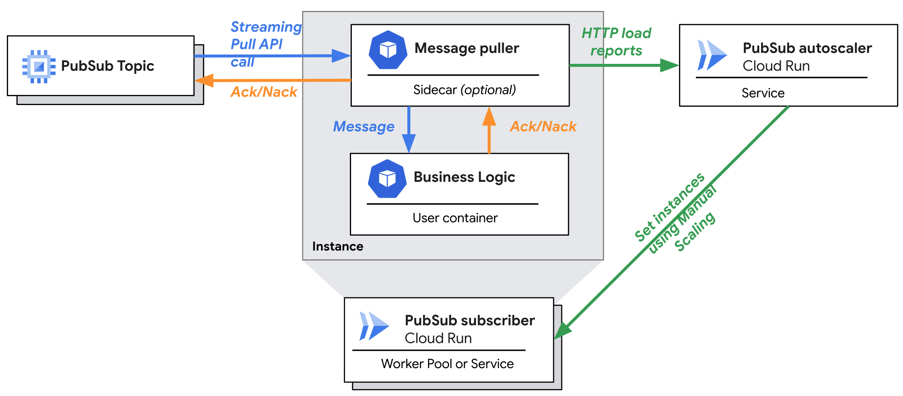

# Cloud Run Pub/Sub Pull Example

## Overview

This directory contains example code for autoscaling a Cloud Run service or
worker pool that consumes messages from a Cloud Pub/Sub topic using a pull
subscription based on utilization reported by the consumer instances.

This README explains the architecture, code structure, and how to build,
configure, deploy, and observe the example code.

NOTE: This project is intended for demonstration purposes only. It is not
intended for use in a production environment.

NOTE: This is not an officially supported Google product. This project is not
eligible for the
[Google Open Source Software Vulnerability Rewards Program](https://bughunters.google.com/open-source-security).

## Architecture

The example has three components:

1.  The application business logic that consumes Pub/Sub messages. This doc will
    refer to this as the "consumer".
1.  A library or sidecar that runs alongside the application business logic,
    owns the streaming pull connection to Cloud Pub/Sub, records metrics, and
    reports metrics to the scaler service. This doc will refer to this, together
    with the "consumer", as the "worker".
1.  A Cloud Run service that receives metrics from the worker sidecar/library
    over HTTP, aggregates the metrics across worker instances, makes a scaling
    decision, and updates the worker's instance count using the Cloud Run admin
    API and the manual scaling instance count field. This doc will refer to this
    as the "scaler".

The following diagram provides a visual overview of the system's architecture



The following subsections describe details of each component:

### Consumer: Application business logic

The application business logic implements processing the Pub/Sub messages. The
application business logic is always responsible for acking messages to confirm
their processing. The application business logic can nack messages to indicate
failure, or if the worker sidecar/library receives an error from the application
business logic it will automatically nack the message.

This example provides basic application business logic that sleeps for a
configurable amount of time for each Pub/Sub message and nacks Pub/Sub messages
at a configurable rate.

### Worker sidecar/library

The worker portion of the example can be used either as a sidecar container or a
Go library.

The worker owns the streaming pull connection to Cloud Pub/Sub. Owning the
Pub/Sub connection allows the worker to track how many messages the consumer is
processing at any given point in time to compute a utilization for the consumer
based on its configured maximum concurrent messages capacity. The worker then
reports that utilization to the scaler to provide the autoscaling signal.

#### Sidecar vs. library

In sidecar mode, the worker and consumer application business logic are built
separately as two distinct containers. Sidecar mode provides full flexibility to
implement the consumer application business logic in any programming language
using any framework.

At deployment time, sidecar mode deploys as a Cloud Run service or worker pool
running both the worker sidecar and consumer application business logic
containers inside each Cloud Run instance ("multicontainer" or "sidecar"
deployment). The worker sidecar takes as configuration a localhost URL to use to
reach the consumer container over HTTP on the local network within the instance.
When the worker sidecar pulls a message from Pub/Sub, it forwards the message to
the consumer over this local HTTP connection with the message in the Cloud
Pub/Sub
[push subscription JSON format](https://cloud.google.com/pubsub/docs/push#receive_push).
The worker sidecar considers a `2xx` response from the consumer an `ack` and a
non-`2xx` response a `nack`.

Library mode provides a simpler, lighter weight deployment but requires the
consumer application business logic be written in Go. In library mode, the end
user writing the application business logic writes a `main` file that
instantiates the `puller` library found in `puller/puller.go`. The `puller`
library takes a callback that the library uses to invoke the application
business logic for each Pub/Sub message. In library mode, the application
business logic receives the `pubsub.Message` object and can call the `Ack` or
`Nack` methods itself. If the application business logic returns an error, the
`puller` library will call `Nack` on the message.

#### Directly exporting metrics from application business logic

A third deployment option besides using the worker sidecar/library is for the
application business logic to export the required metrics to the scaler itself.
To do so, the application business logic must:

1.  Track the average number of active messages over time.
    *   The time window over which average active messages is tracked influences
        scaling speed. A shorter time window will scale faster, while a longer
        time window will be more stable.
    *   To avoid missing data, the average time window must be longer than the
        configured reporting interval for metric reports to the scaler.
1.  Report the required fields specified in the [api](#api) section below to the
    scaler.
    *   Metric reports must be sent to the scaler periodically.
    *   The metric reporting interval should be less than the configured scaler
        cycle frequency to avoid the scaler running consecutive cycles on the
        same data.
    *   A shorter metric reporting interval increases reliability because if an
        individual report request fails, subsequent requests will try again
        before the next scaler cycle runs.
    *   A longer metric reporting interval decreases load on the scaler service.
        But metric report handling is lightweight, so any reporting interval
        above 1 second should be fine.

### Scaler

The scaler runs as a Cloud Run service.

The scaler receives metrics reports from the worker sidecar/library over the
standard Cloud Run HTTP ingress path.

The scaler runs a background loop that periodically re-computes the recommended
worker instance count based on the most recently reported metrics from each
worker. When the new worker instance count recommendation is different from the
current instance count, the scaler updates the worker instance count by setting
the manual scaling instance count using the Cloud Run admin API.

Note that the scaler service needs to run with
[manual scaling](https://cloud.google.com/run/docs/configuring/services/manual-scaling)
instance count set to 1 (or min instances and max instances both set to 1) so
that there is always 1 scaler instance running. The scaler requires a single
instance because the same scaler instance must receive the metrics reports from
all worker instances to make correct scaling decisions.

The scaler service also needs
[CPU throttling disabled](https://cloud.google.com/run/docs/configuring/billing-settings#cpu-allocation-impact)
because it runs the scaling algorithm in a background loop outside the scope of
any HTTP request.

### Worker-Scaler Metrics API {#api}

The worker sidecar/library reports metrics to the scaler using a JSON HTTP API.
The scaler expects HTTP POST requests to the `/reportLoad` path with a body
containing the JSON serialization of the `api/api.go` struct.

The following is an example of the JSON payload:

```json
{
   // Required. Timestamp in RFC 3339 format.
  "ReportTime": "2025-05-06T11:37:26.594640593-07:00",
  // Required. String.
  "InstanceID": "instance-1",
  // Optional. int64 nanoseconds.
  "MaxPullLatency":10000000,
  // Optional. int64 nanoseconds.
  "AveragePullLatency":10000000,
  // Optional. float64.
  "ProcessingRate": 1.1,
  // Required. float64.
  "AverageActiveMessages": 5,
  // Required. int32.
  "MaxActiveMessagesLimit":  10,
  // Required. int64 nanoseconds.
  "MetricWindowLength":30000000000
}
```

## Code Structure

The code structure of this example is as follows:

*   `api/`: Contains the Go struct defining the metrics reporting API between
    the worker sidecar/library and the scaler.
*   `cmd/`: Contains buildable binaries
    *   `cmd/exampleconsumer`: An example consumer binary to use with the worker
        in sidecar mode.
    *   `cmd/scaler`: The scaler binary.
    *   `cmd/worker`: The worker sidecar binary.
*   `consumer/`: Library implementing the interface between the worker
    sidecar/library and the consumer application business logic.
*   `metrics/`: Library implementing metrics tracking and reporting within the
    worker sidecar/library.
*   `pubsubmessage/`: A light wrapper around the Cloud Pub/Sub client library to
    provide some additional state tracking.
*   `puller/`: The core library implementing the worker. Owns the Pub/Sub
    connection. Instantiated in library mode.
*   `scaler/`: All of the code for the scaler binary, except the `main` file.

## Deploying

### Configuration variables {#config}

First, some configuration variables for the `gcloud` commands in this guide:

```sh
# Example: "us-central1-docker.pkg.dev/<project ID>/<repo name>"
ARTIFACT_REGISTRY_REPO="<Repository name to push container images to.>"
```

If using `gcloud` to deploy and configure or using Terraform and deploying the
worker as a Cloud Run worker pool, set the additional configuration variables
below. If using Terraform, similar values need to be passed as Terraform `vars`.
If using Terraform and deploying the worker as a Cloud Run service, these
variables are unnecessary.

```sh
PROJECT_ID="<GCP project ID to deploy Cloud Run resources to>"
# Project number is used to construct Cloud Run's default URLs for routing
# requests from the worker to the scaler.
PROJECT_NUMBER="<GCP project number to deploy Cloud Run resources to>"
PUBSUB_SUBSCRIPTION_ID="<PubSub subscription ID to pull from. Ex. 'my-subscription'>"
# The Pub/Sub subscription project ID. Defaults to the same project as
# $PROJECT_ID, but can be a different project.
PUBSUB_SUBSCRIPTION_PROJECT_ID="${PROJECT_ID}"
REGION="<GCP region to deploy Cloud Run resources to>"
```

### Build container images

To build the `scaler` and `worker` container images, use
[Cloud Build with buildpacks](https://cloud.google.com/build/docs/building/build-containers#use-buildpacks).

Run all commands from the module root directory (this directory).

To build the `scaler` image:

```sh
gcloud builds submit --pack env="GOOGLE_BUILDABLE=./cmd/scaler",image="${ARTIFACT_REGISTRY_REPO}/scaler"
```

If using the worker in sidecar mode, build the `worker` image:

```sh
gcloud builds submit --pack env="GOOGLE_BUILDABLE=./cmd/worker",image="${ARTIFACT_REGISTRY_REPO}/worker"
```

To build an example consumer that sleeps for a configurable amount of time and
randomly nacks messages at a configured rate:

```sh
gcloud builds submit --pack env="GOOGLE_BUILDABLE=./cmd/exampleconsumer",image="${ARTIFACT_REGISTRY_REPO}/exampleconsumer"
```

### Deploy using Terraform

#### Worker as a Cloud Run worker pool

To deploy using Terraform with the worker deployed as a Cloud Run worker pool,
`cd` to the `terraform/workerpool` subdirectory and run:

```sh
terraform apply \
  -var="cloud_run_project_id=<Project ID to deploy Cloud Run resources to>" \
  -var="region=<Region to deploy to>" \
  -var="artifact_registry_repo=${ARTIFACT_REGISTRY_REPO}" \
  -var="pubsub_subscription_project_id=<Project ID containing PubSub subscription>" \
  -var="pubsub_subscription_id=<ID of the PubSub subscription>"
```

This command will:

*   Create necessary service accounts
*   Grant permissions
*   Deploy the scaler service
*   Deploy the worker as a Cloud Run worker pool

#### Worker as a Cloud Run service

To deploy using Terraform with the worker deployed as a Cloud Run service, `cd`
to the `terraform/service` subdirectory and run:

```sh
terraform apply \
  -var="cloud_run_project_id=<Project ID to deploy Cloud Run resources to>" \
  -var="region=<Region to deploy to>" \
  -var="artifact_registry_repo=${ARTIFACT_REGISTRY_REPO}" \
  -var="pubsub_subscription_project_id=<Project ID containing PubSub subscription>" \
  -var="pubsub_subscription_id=<ID of the PubSub subscription>"
```

This command will:

*   Create necessary service accounts
*   Grant permissions
*   Deploy the scaler service
*   Deploy the worker as a Cloud Run service

### Deploy using `gcloud`

#### Create service accounts and grant permissions

Create two service accounts to use as the workload identities of the scaler and
worker when deploying to Cloud Run.

```sh
gcloud iam service-accounts create scaler --project="${PROJECT_ID}"
gcloud iam service-accounts create worker --project="${PROJECT_ID}"
```

Grant the worker permission to subscribe to the Pub/Sub topic:

```sh
gcloud pubsub subscriptions add-iam-policy-binding "${PUBSUB_SUBSCRIPTION_ID}" \
  --member="serviceAccount:worker@${PROJECT_ID}.iam.gserviceaccount.com" \
  --role="roles/pubsub.subscriber" \
  --project="${PUBSUB_SUBSCRIPTION_PROJECT_ID}"
```

Grant the scaler service account permission to use the worker service account.
Necessary for the scaler service to be able to update the instance count of the
worker service through the Cloud Run admin API:

```sh
gcloud iam service-accounts add-iam-policy-binding \
  "worker@${PROJECT_ID}.iam.gserviceaccount.com" \
  --member="serviceAccount:scaler@${PROJECT_ID}.iam.gserviceaccount.com" \
  --role="roles/iam.serviceAccountUser" \
  --project="${PROJECT_ID}"

```

#### Deploy worker

Deploy the consumer application business logic along with the worker
sidecar/library:

##### Deploy in sidecar mode {#deploy}

Configure command line arguments:

```sh
PULLER_ARGS=(
  "--subscription_project_id=${PUBSUB_SUBSCRIPTION_PROJECT_ID}"
  "--subscription_id=${PUBSUB_SUBSCRIPTION_ID}"
  "--reporting_url=https://scaler-${PROJECT_NUMBER}.${REGION}.run.app/reportLoad"
  "--reporting_audience=https://scaler-${PROJECT_NUMBER}.${REGION}.run.app/"
  # Set to configure the maximum number of messages a single worker will pull
  # from Pub/Sub at once.
  "--max_outstanding_messages=20"
  # The duration over which average active messages is averaged. A higher value
  # gives more stable scaling. A lower value gives more responsive scaling.
  "--metric_window_length=10s"
  "--local_push_url=http://localhost:8080"
)

CONSUMER_ARGS=(
  # How long to sleep for each Pub/Sub message
  "--sleep_duration=1s"
  # Integer percent in [0, 100] of Pub/Sub messages to randomly nack.
  "--nack_percent=0"
  # Enable verbose logging at level 3.
  "-v=3"
  # Write logs to stderr instead of a file.
  "--logtostderr"
)
```

NOTE: The following commands deploy the `exampleconsumer` image built above as
the Pub/Sub consumer. This is intended for demo/test purposes. In a real
application, the `exampleconsumer` image would be replaced with the application
business logic.


###### As a worker pool

To deploy as a worker pool in sidecar mode:

```sh
gcloud alpha run worker-pools deploy worker \
    --region="${REGION}" \
    --project="${PROJECT_ID}" \
    --scaling=1 \
    --service-account="worker@${PROJECT_ID}.iam.gserviceaccount.com" \
    --container="puller" \
    --image="${ARTIFACT_REGISTRY_REPO}/worker" \
    --args="$(IFS=,; echo "${PULLER_ARGS[*]}")" \
    --container="consumer" \
    --image="${ARTIFACT_REGISTRY_REPO}/exampleconsumer" \
    --args="$(IFS=,; echo "${CONSUMER_ARGS[*]}")"
```

###### As a service

To deploy as a service in sidecar mode:

```sh
gcloud beta run deploy worker \
    --region="${REGION}" \
    --project="${PROJECT_ID}" \
    --scaling=1 \
    --no-cpu-throttling \
    --service-account="worker@${PROJECT_ID}.iam.gserviceaccount.com" \
    --no-allow-unauthenticated \
    --container="puller" \
    --image="${ARTIFACT_REGISTRY_REPO}/worker" \
    --args="$(IFS=,; echo "${PULLER_ARGS[*]}")" \
    --container="consumer" \
    --image="${ARTIFACT_REGISTRY_REPO}/exampleconsumer" \
    --args="$(IFS=,; echo "${CONSUMER_ARGS[*]}")" \
    --port=8080
```

After deploying the worker, grant the scaler's service account `roles/run.admin`
on the project to allow the scaler to update the worker's instance count.

```sh
gcloud projects add-iam-policy-binding "${PROJECT_ID}" \
  --member="serviceAccount:scaler@${PROJECT_ID}.iam.gserviceaccount.com" \
  --role="roles/run.admin"
```

#### Deploy scaler

To deploy the scaler service:

```sh
# Resource type of the worker deployment. Set to "services" if the worker is
# deployed as a service.
RESOURCE_TYPE="workerPools"

SCALER_ARGS=(
  # The target utilization to scale for.
  "--target_utilization=0.8"
  # Minimum number of worker instances to always keep running. Must be >= 1.
  "--min_instances=1"
  # Optional. Maximum number of worker instances to run.
  "--max_instances=100"
  # The full resource name of the deployed worker.
  "--resource_name=projects/${PROJECT_ID}/locations/${REGION}/${RESOURCE_TYPE}/worker"
  # The scaling cycle frequency.
  "--cycle_frequency=10s"
)

gcloud run deploy scaler \
  --region="${REGION}" \
  --project="${PROJECT_ID}" \
  --image="${ARTIFACT_REGISTRY_REPO}/scaler" \
  --no-allow-unauthenticated \
  --no-cpu-throttling \
  --concurrency=1000 \
  --max-instances=1 \
  --args="$(IFS=,; echo "${SCALER_ARGS[*]}")" \
  --service-account="scaler@${PROJECT_ID}.iam.gserviceaccount.com"
```

To allow the worker to send metrics reports to the scaler:

```sh
gcloud run services add-iam-policy-binding scaler \
  --member="serviceAccount:worker@${PROJECT_ID}.iam.gserviceaccount.com" \
  --role="roles/run.invoker" \
  --region="${REGION}" \
  --project="${PROJECT_ID}"
```

## Observability

The standard Pub/Sub topic and subscription monitoring metrics show message
publish rate, delivery rate, and ack rate along with the number of unacked
messages.

The standard Cloud Run instance count metric shows the number of instances of
the service/worker pool worker that is autoscaled by the scaler service.

The scaler service writes log messages that provide detailed insight into its
behavior.

First, the scaler logs each metrics report it receives from the worker. Use the
following logs query to see the metrics reports:

```
resource.type="cloud_run_revision"
resource.labels.service_name="scaler"
severity>=DEFAULT
textPayload=~".*Received load report:.*"
```

Second, the scaler logs the scaling decision it makes during each scaling cycle
along with the status of actuating the decision via the Cloud Run admin API. Use
the following logs query to see the scaling decisions and admin API call
results:

```
resource.type="cloud_run_revision"
resource.labels.service_name="scaler"
severity>=DEFAULT
-logName=~"projects/.*/logs/run.googleapis.com%2Frequests"
-textPayload=~".*Received load report:.*"
```

## Costs

The deployed Cloud Run resources, the worker service or worker pool and the
scaler service, are billed for compute time used at the
[Cloud Run prices](https://cloud.google.com/run/pricing).

The scaler service runs with max instances set to 1, so at most one instance is
running at all times and costs are limited.

The worker service/worker pool is autoscaled by the scaler service based on its
utilization. The cost to run the worker depends on the Pub/Sub traffic pattern
and increases as Pub/Sub traffic increases.

To limit worker costs, set the `--max_instances` argument on the deployed scaler
as shown in the example. The `--max_instances` argument places a maximum on the
number of worker instances the scaler service will recommend and actuate.

### Monitoring costs

The
[`run.googleapis.com/container/billable_instance_time` monitoring metric](https://cloud.google.com/monitoring/api/metrics_gcp#gcp-run)
is a real-time monitoring metric that gives a proxy for cost.

To directly monitor costs, use Cloud Billing's
[budgets](https://cloud.google.com/billing/docs/how-to/budgets) and
[budget alerts](https://cloud.google.com/billing/docs/how-to/budgets-notification-recipients).
Note that there is ingestion delay between when usage occurs and when the usage
appears in Cloud Billing.

### Shutting down usage to stop billing

Usage and billing can be stopped two ways: deleting the billed Cloud Run
resources or disabling billing for the whole project.

#### Delete Cloud Run resources

Deleting the deployed Cloud Run resources will stop accumulating any charges
associated with this example code, but will leave any other resources in the GCP
project active.

To delete the scaler, run:

```sh
gcloud run services delete scaler \
  --region="${REGION}" \
  --project="${PROJECT_ID}"
```

If the worker is deployed as a worker pool, delete the worker by running:

```sh
gcloud alpha run worker-pools delete worker \
  --region="${REGION}" \
  --project="${PROJECT_ID}"
```

If the worker is deployed as a service, delete the worker by running:

```sh
gcloud run services delete worker \
  --region="${REGION}" \
  --project="${PROJECT_ID}"
```

#### Disable billing for the project

To disable billing for the entire project, follow the instructions in the
[documentation](https://cloud.google.com/billing/docs/how-to/modify-project#disable_billing_for_a_project).
